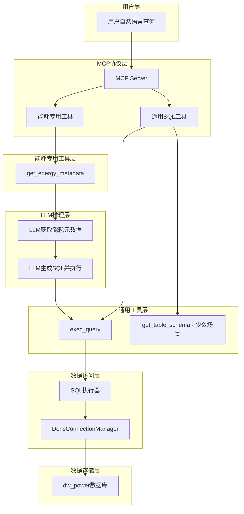

# 能耗BI Chat 设计文档

## 概述

基于Apache Doris MCP Server现有架构，通过添加一个轻量级的能耗业务上下文工具，配合现有的`exec_query`等通用MCP工具，实现智能能耗数据对话分析系统。该系统将利用现有的dw_power数据库，为用户提供自然语言的能耗数据查询和分析服务。

**核心理念**：最小化新增工具，最大化利用现有的通用查询工具。

## 架构设计

### 系统架构图



### 核心组件

#### 1. 能耗元数据工具 (替代通用数据库查询工具)
- **工具名称**: `get_energy_metadata`
- **功能**: 根据能耗查询场景提供相应的元数据信息，替代`get_db_list`、`get_db_table_list`等通用工具
- **参数**: 
  - `scenario`: 查询场景（overview, consumption, comparison, distribution, realtime）

#### 2. 通用工具 (少数场景使用)
- **exec_query**: 执行LLM生成的SQL查询 (主要工具)
- **get_table_schema**: 获取具体表的详细结构 (少数复杂场景)

## 组件设计

### 1. 工具注册 (Tool Registration)

在`DorisToolsManager.register_tools_with_mcp()`方法中添加能耗专用元数据工具：

```python
@mcp.tool(
    "get_energy_metadata",
    description="""能耗数据库专用元数据工具。根据能耗查询的常见场景提供相应的元数据信息，替代通用的数据库查询工具。

参数说明：
- scenario (string) [可选] - 查询场景，默认"overview"
  * "overview": 数据库概览和主要表信息（适合初次了解）
  * "consumption": 能耗统计查询场景（日常用电量、工序消耗等）
  * "comparison": 能耗对比分析场景（同比、环比、趋势分析）
  * "distribution": 能耗分布分析场景（各部门占比、排名等）
  * "realtime": 实时监控场景（小时、分钟级数据）
""",
)
async def get_energy_metadata_tool(
    scenario: str = "overview"
) -> str:
    return await self.call_tool("get_energy_metadata", {
        "scenario": scenario
    })
```

### 2. 业务逻辑处理器 (EnergyMetadataTools)

创建专用的元数据工具类`doris_mcp_server/utils/energy_metadata_tools.py`：

```python
class EnergyMetadataTools:
    """能耗数据库专用元数据工具 - 替代通用数据库查询工具"""
    
    def __init__(self, connection_manager: DorisConnectionManager):
        self.connection_manager = connection_manager
    
    async def get_energy_metadata(self, scenario: str = "overview") -> Dict[str, Any]:
        """根据查询场景获取相应的能耗元数据"""
        
        try:
            if scenario == "overview":
                return await self._get_overview_metadata()
            elif scenario == "consumption":
                return await self._get_consumption_metadata()
            elif scenario == "comparison":
                return await self._get_comparison_metadata()
            elif scenario == "distribution":
                return await self._get_distribution_metadata()
            elif scenario == "realtime":
                return await self._get_realtime_metadata()
            else:
                return await self._get_overview_metadata()
                
        except Exception as e:
            logger.error(f"Failed to get energy metadata for scenario {scenario}: {e}")
            return {
                "error": f"获取能耗元数据失败: {str(e)}",
                "scenario": scenario,
                "timestamp": datetime.now().isoformat()
            }
    
    async def _get_overview_metadata(self) -> Dict[str, Any]:
        """概览场景 - 数据库基本信息"""
        return {
            "scenario": "overview",
            "database": "dw_power",
            "description": "能耗数据仓库 - 包含企业能源消耗统计和分析数据",
            "main_tables": [
                {
                    "name": "ads_energy_consume_day",
                    "description": "日能耗统计 - 最常用的表",
                    "usage": "日常能耗查询、按工序统计、能源类型分析"
                },
                {
                    "name": "ads_energy_consume_mon", 
                    "description": "月能耗统计 - 月度报告",
                    "usage": "月度对比、长期趋势分析"
                },
                {
                    "name": "ads_bus_energy_analysis",
                    "description": "业务能耗分析 - 按工序维度",
                    "usage": "工序能耗深度分析"
                }
            ],
            "key_fields": {
                "meter_value": "实物量 - 实际消耗的能源数量",
                "process_name": "生产工序名称",
                "energy_type_name": "能源类型名称",
                "summary_time": "统计时间"
            },
            "common_filters": {
                "电力": "energy_type_name LIKE '%电%'",
                "今天": "DATE(summary_time) = CURDATE()",
                "本月": "YEAR(summary_time) = YEAR(CURDATE()) AND MONTH(summary_time) = MONTH(CURDATE())"
            },
            "timestamp": datetime.now().isoformat()
        }
    
    async def _get_consumption_metadata(self) -> Dict[str, Any]:
        """能耗统计场景 - 日常用电量查询"""
        return {
            "scenario": "consumption",
            "description": "能耗统计查询场景 - 适用于总用电量、工序消耗等查询",
            "recommended_tables": [
                {
                    "name": "ads_energy_consume_day",
                    "columns": ["summary_time", "process_name", "energy_type_name", "meter_value", "coefficient_value"],
                    "usage": "日常能耗统计的主表"
                },
                {
                    "name": "ads_energy_consume_hour",
                    "columns": ["summary_time", "process_name", "energy_type_name", "meter_value"],
                    "usage": "小时级能耗分析"
                }
            ],
            "query_patterns": [
                {
                    "question_type": "总用电量",
                    "sql_pattern": "SELECT SUM(meter_value) FROM dw_power.ads_energy_consume_day WHERE energy_type_name LIKE '%电%' AND [时间条件]",
                    "example": "今天总用电量是多少？"
                },
                {
                    "question_type": "工序用电",
                    "sql_pattern": "SELECT process_name, SUM(meter_value) FROM dw_power.ads_energy_consume_day WHERE energy_type_name LIKE '%电%' GROUP BY process_name",
                    "example": "各个工序的用电情况？"
                }
            ],
            "energy_types": {
                "电力": "energy_type_name LIKE '%电%'",
                "天然气": "energy_type_name LIKE '%气%'",
                "煤炭": "energy_type_name LIKE '%煤%'"
            },
            "timestamp": datetime.now().isoformat()
        }
    
    async def _get_comparison_metadata(self) -> Dict[str, Any]:
        """对比分析场景 - 同比环比分析"""
        return {
            "scenario": "comparison",
            "description": "能耗对比分析场景 - 适用于同比、环比、趋势分析",
            "recommended_tables": [
                {
                    "name": "ads_energy_consume_mon",
                    "time_field": "summary_time",
                    "format": "YYYYMM格式，如202412",
                    "usage": "月度对比分析"
                },
                {
                    "name": "ads_bus_energy_comparison",
                    "special_fields": ["now_value", "same_value", "date_type"],
                    "usage": "专门的对比分析表"
                }
            ],
            "comparison_patterns": [
                {
                    "type": "月度对比",
                    "sql_pattern": "使用ads_energy_consume_mon表，比较不同月份的summary_time",
                    "example": "本月比上月用电量增加了多少？"
                },
                {
                    "type": "年度对比", 
                    "sql_pattern": "使用ads_energy_consume_year表，比较不同年份",
                    "example": "今年比去年用电量如何？"
                }
            ],
            "time_calculations": {
                "当月": "DATE_FORMAT(CURDATE(), '%Y%m')",
                "上月": "DATE_FORMAT(DATE_SUB(CURDATE(), INTERVAL 1 MONTH), '%Y%m')",
                "去年同月": "DATE_FORMAT(DATE_SUB(CURDATE(), INTERVAL 1 YEAR), '%Y%m')"
            },
            "timestamp": datetime.now().isoformat()
        }
    
    async def _get_distribution_metadata(self) -> Dict[str, Any]:
        """分布分析场景 - 各部门占比、排名"""
        return {
            "scenario": "distribution",
            "description": "能耗分布分析场景 - 适用于各部门占比、排名分析",
            "recommended_tables": [
                {
                    "name": "ads_energy_distribution",
                    "key_fields": ["alias_name", "power_consumption", "proportion"],
                    "usage": "专门的分布分析表"
                },
                {
                    "name": "ads_energy_consume_day",
                    "group_fields": ["process_name", "process_unit_name"],
                    "usage": "按工序或车间分组分析"
                }
            ],
            "analysis_patterns": [
                {
                    "type": "工序排名",
                    "sql_pattern": "GROUP BY process_name ORDER BY SUM(meter_value) DESC",
                    "example": "哪个工序耗电最多？"
                },
                {
                    "type": "车间排名",
                    "sql_pattern": "GROUP BY process_unit_name ORDER BY SUM(meter_value) DESC", 
                    "example": "哪个车间耗电最多？"
                },
                {
                    "type": "占比分析",
                    "sql_pattern": "计算各部门占总消耗的百分比",
                    "example": "各工序用电占比情况？"
                }
            ],
            "percentage_calculation": "ROUND(SUM(meter_value) * 100.0 / (SELECT SUM(meter_value) FROM ...), 2) as percentage",
            "timestamp": datetime.now().isoformat()
        }
    
    async def _get_realtime_metadata(self) -> Dict[str, Any]:
        """实时监控场景 - 小时、分钟级数据"""
        return {
            "scenario": "realtime",
            "description": "实时监控场景 - 适用于小时、分钟级能耗监控",
            "recommended_tables": [
                {
                    "name": "ads_energy_consume_minute",
                    "granularity": "15分钟",
                    "usage": "实时监控，最细粒度数据"
                },
                {
                    "name": "ads_energy_consume_hour",
                    "granularity": "1小时",
                    "usage": "小时级趋势分析"
                }
            ],
            "monitoring_patterns": [
                {
                    "type": "当前小时用电",
                    "sql_pattern": "WHERE HOUR(summary_time) = HOUR(NOW()) AND DATE(summary_time) = CURDATE()",
                    "example": "当前小时用电量是多少？"
                },
                {
                    "type": "今日小时趋势",
                    "sql_pattern": "GROUP BY HOUR(summary_time) ORDER BY summary_time",
                    "example": "今天各小时的用电趋势？"
                }
            ],
            "time_filters": {
                "当前小时": "HOUR(summary_time) = HOUR(NOW()) AND DATE(summary_time) = CURDATE()",
                "最近1小时": "summary_time >= DATE_SUB(NOW(), INTERVAL 1 HOUR)",
                "今日按小时": "DATE(summary_time) = CURDATE() GROUP BY HOUR(summary_time)"
            },
            "timestamp": datetime.now().isoformat()
        }
    
    def _get_table_metadata(self) -> Dict[str, Any]:
        """获取表结构元数据 - 基于dw_power.sql的静态配置"""
        
        # 基于dw_power.sql文件整理的完整表信息
        tables_config = {
            # 能源分析报表类
            "ads_bus_energy_analysis": {
                "description": "能源分析报表 - 按生产工序统计的能源消耗分析",
                "usage": "用于分析各生产工序的能源消耗情况，支持按日/月/年维度查询",
                "category": "分析报表",
                "key_fields": ["id", "date_type", "alias_name", "actual_value", "coefficient_value"]
            },
            "ads_bus_energy_comparison": {
                "description": "能源对比报表 - 能源类型的同比环比分析",
                "usage": "用于能源消耗的时间对比分析，支持同比、环比计算",
                "category": "对比分析",
                "key_fields": ["energy_type_code", "date_type", "now_value", "same_value"]
            },
            "ads_bus_energy_consume": {
                "description": "能源消耗报表 - 综合能源消耗统计",
                "usage": "用于综合能源消耗分析，包含实物量和折标量",
                "category": "消耗统计",
                "key_fields": ["id", "date_type", "actual_value", "coefficient_value"]
            },
            
            # 时间粒度能耗统计类
            "ads_energy_consume_minute": {
                "description": "能耗统计分析15分钟 - 最细粒度的实时能耗数据",
                "usage": "用于实时监控和短时间内的能耗波动分析",
                "category": "实时数据",
                "key_fields": ["summary_time", "process_code", "energy_type_code", "meter_value"]
            },
            "ads_energy_consume_hour": {
                "description": "能耗统计分析小时 - 小时级能耗汇总数据",
                "usage": "用于小时级趋势分析、班次对比、设备运行状态分析",
                "category": "小时数据",
                "key_fields": ["summary_time", "process_name", "energy_type_name", "meter_value", "coefficient_value"]
            },
            "ads_energy_consume_day": {
                "description": "能耗统计分析天 - 日级能耗汇总数据，最常用的查询表",
                "usage": "日常能耗查询的主要表，适合按日、工序、能源类型统计，包含电费信息",
                "category": "日数据",
                "key_fields": ["summary_time", "process_name", "energy_type_name", "meter_value", "total_electricity_fee"]
            },
            "ads_energy_consume_mon": {
                "description": "能耗统计分析月 - 月级能耗汇总数据",
                "usage": "月度能耗报告，适合月度对比和长期趋势分析，包含详细的电费分析",
                "category": "月数据",
                "key_fields": ["summary_time", "process_name", "energy_type_name", "meter_value", "total_electricity_fee"]
            },
            "ads_energy_consume_qua": {
                "description": "能耗统计分析季度 - 季度级能耗汇总数据",
                "usage": "季度能耗分析，适合季节性分析和中期规划",
                "category": "季度数据",
                "key_fields": ["summary_time", "process_name", "energy_type_name", "meter_value"]
            },
            "ads_energy_consume_year": {
                "description": "能耗统计分析年 - 年级能耗汇总数据",
                "usage": "年度能耗统计，适合年度报告和长期规划",
                "category": "年数据",
                "key_fields": ["summary_time", "process_name", "energy_type_name", "meter_value"]
            },
            "ads_energy_consume_shift": {
                "description": "能耗统计分析班组 - 按班组统计的能耗数据",
                "usage": "班组能耗分析，适合班组绩效对比和班次管理",
                "category": "班组数据",
                "key_fields": ["summary_time", "shift_type", "process_name", "meter_value"]
            },
            
            # 专项分析类
            "ads_energy_distribution": {
                "description": "能源分布情况 - 各部门/工序的能耗占比分析",
                "usage": "用于分析能源消耗的分布情况和占比，支持实时与历史对比",
                "category": "分布分析",
                "key_fields": ["id", "date_type", "power_consumption", "proportion"]
            },
            "ads_smart_energy_analysis": {
                "description": "智能用能分析 - 智能化能源分析和限额管理",
                "usage": "用于智能用能分析，包含限额对比和全厂标识",
                "category": "智能分析",
                "key_fields": ["id", "date_type", "power_consumption", "limit_value"]
            },
            
            # 碳排放分析类
            "ads_co2_fossil_comb_mon": {
                "description": "二氧化碳排放量报告化石燃料燃烧 - 化石燃料燃烧产生的CO2排放",
                "usage": "用于计算和分析化石燃料燃烧产生的二氧化碳排放量",
                "category": "碳排放",
                "key_fields": ["summary_time", "energy_type_name", "CO2_emissions"]
            },
            "ads_co2_indust_process_mon": {
                "description": "二氧化碳排放量报告工业生产过程 - 工业过程产生的CO2排放",
                "usage": "用于计算和分析工业生产过程中产生的二氧化碳排放量",
                "category": "碳排放",
                "key_fields": ["summary_time", "energy_type_name", "CO2_emissions"]
            },
            "ads_co2_net_purchases_mon": {
                "description": "二氧化碳排放量报告净购入电力、热力 - 外购能源的CO2排放",
                "usage": "用于计算和分析净购入电力、热力产生的二氧化碳排放量",
                "category": "碳排放",
                "key_fields": ["summary_time", "energy_type_name", "CO2_emissions"]
            },
            
            # 维度表类 (基于SQL中可能存在的维度表)
            "dim_alarm_setting": {
                "description": "告警设置维度表 - 能耗告警的配置信息",
                "usage": "用于配置和管理能耗相关的告警规则和阈值",
                "category": "配置表",
                "key_fields": ["alarm_id", "alarm_name", "threshold_value"]
            }
        }
        
        # 转换为列表格式
        tables = []
        for table_name, config in tables_config.items():
            tables.append({
                "table_name": table_name,
                "description": config["description"],
                "usage": config["usage"],
                "category": config["category"],
                "key_fields": config["key_fields"]
            })
        
        return {
            "database_name": "dw_power",
            "description": "能耗数据仓库 - 基于dw_power.sql的完整表配置",
            "table_count": len(tables),
            "tables": tables,
            "timestamp": datetime.now().isoformat()
        }

    
    def _get_business_context(self) -> Dict[str, Any]:
        """获取业务上下文 - 通用业务规则，不限定特定表"""
        return {
            "business_rules": {
                "energy_types": {
                    "电力": {"unit": "千瓦时", "filter": "energy_type_name LIKE '%电%'"},
                    "天然气": {"unit": "立方米", "filter": "energy_type_name LIKE '%气%'"},
                    "煤炭": {"unit": "吨", "filter": "energy_type_name LIKE '%煤%'"},
                    "热力": {"unit": "吉焦", "filter": "energy_type_name LIKE '%热%'"},
                    "蒸汽": {"unit": "吨", "filter": "energy_type_name LIKE '%蒸汽%'"},
                    "水": {"unit": "立方米", "filter": "energy_type_name LIKE '%水%'"}
                },
                "common_fields": {
                    "meter_value": "实物量 - 实际消耗的能源数量，用于计算总消耗",
                    "coefficient_value": "折标量 - 折算为标准煤的当量值，用于不同能源对比",
                    "process_name": "生产工序名称 - 用于按工序分组分析",
                    "process_unit_name": "生产工序单元名称 - 具体的车间或生产单位",
                    "energy_type_name": "能源类型名称 - 用于过滤特定能源类型",
                    "summary_time": "统计时间 - 用于时间范围过滤",
                    "equipment_unit_name": "设备名称 - 具体设备标识",
                    "analysis_name": "分析指标名称 - 分析维度",
                    "total_electricity_fee": "总电费 - 电力消耗费用"
                },
                "time_patterns": {
                    "今天": "DATE(summary_time) = CURDATE()",
                    "昨天": "DATE(summary_time) = DATE_SUB(CURDATE(), INTERVAL 1 DAY)",
                    "本周": "YEARWEEK(summary_time) = YEARWEEK(CURDATE())",
                    "本月": "YEAR(summary_time) = YEAR(CURDATE()) AND MONTH(summary_time) = MONTH(CURDATE())",
                    "上月": "summary_time = DATE_FORMAT(DATE_SUB(CURDATE(), INTERVAL 1 MONTH), '%Y%m')",
                    "本年": "YEAR(summary_time) = YEAR(CURDATE())",
                    "上年": "YEAR(summary_time) = YEAR(CURDATE()) - 1"
                },
                "aggregation_patterns": {
                    "总消耗": "SUM(meter_value)",
                    "平均消耗": "AVG(meter_value)",
                    "最大消耗": "MAX(meter_value)",
                    "消耗次数": "COUNT(*)",
                    "工序数量": "COUNT(DISTINCT process_code)",
                    "设备数量": "COUNT(DISTINCT equipment_unit_code)"
                }
            },
            "timestamp": datetime.now().isoformat()
        }
    
    def _get_query_examples(self) -> Dict[str, Any]:
        """获取查询示例 - 通用查询模式，不限定特定表"""
        return {
            "examples": [
                {
                    "question": "今天总用电量是多少？",
                    "pattern": "按日期过滤 + 按能源类型过滤 + 求和聚合",
                    "sql_template": """
                    SELECT SUM(meter_value) as total_electricity
                    FROM dw_power.[日级表名] 
                    WHERE energy_type_name LIKE '%电%'
                    AND DATE(summary_time) = CURDATE()
                    """,
                    "key_points": ["选择合适的日级表", "能源类型过滤", "时间过滤", "聚合计算"]
                },
                {
                    "question": "各个工序的用电情况如何？",
                    "pattern": "按工序分组 + 按能源类型过滤 + 排序",
                    "sql_template": """
                    SELECT 
                        process_name,
                        SUM(meter_value) as electricity_consumption
                    FROM dw_power.[合适的表名] 
                    WHERE energy_type_name LIKE '%电%'
                    AND [时间条件]
                    GROUP BY process_name, process_code
                    ORDER BY electricity_consumption DESC
                    """,
                    "key_points": ["工序分组", "包含process_code避免重名", "降序排列"]
                },
                {
                    "question": "本月比上月用电量增加了多少？",
                    "pattern": "时间对比 + 子查询 + 增长率计算",
                    "sql_template": """
                    SELECT 
                        current_data.total_current,
                        previous_data.total_previous,
                        (current_data.total_current - previous_data.total_previous) as difference,
                        ROUND((current_data.total_current - previous_data.total_previous) / previous_data.total_previous * 100, 2) as growth_rate
                    FROM (
                        SELECT SUM(meter_value) as total_current
                        FROM dw_power.[月级表名] 
                        WHERE energy_type_name LIKE '%电%' AND [当月条件]
                    ) current_data
                    CROSS JOIN (
                        SELECT SUM(meter_value) as total_previous
                        FROM dw_power.[月级表名] 
                        WHERE energy_type_name LIKE '%电%' AND [上月条件]
                    ) previous_data
                    """,
                    "key_points": ["使用月级表", "子查询分别计算", "CROSS JOIN连接", "计算增长率"]
                },
                {
                    "question": "查看配置信息或维度数据",
                    "pattern": "直接查询配置表或维度表",
                    "sql_template": """
                    SELECT * FROM dw_power.[dim_或配置表名]
                    WHERE [相关条件]
                    LIMIT 100
                    """,
                    "key_points": ["识别dim_开头的维度表", "识别包含setting/config的配置表", "适当限制返回行数"]
                }
            ],
            "general_guidelines": [
                "根据时间粒度选择合适的表：minute(实时)、hour(小时)、day(日)、mon(月)、year(年)",
                "能源类型过滤使用LIKE模糊匹配：'%电%'、'%气%'、'%煤%'等",
                "工序分析时同时GROUP BY process_name和process_code避免重名问题",
                "时间对比查询优先使用对应粒度的汇总表而不是明细表",
                "配置表和维度表通常用于理解业务规则和数据字典",
                "大数据量查询时注意添加LIMIT限制"
            ],
            "timestamp": datetime.now().isoformat()
        }
```

### 3. 使用流程

1. **用户提问**: "今天总用电量是多少？"

2. **LLM根据问题选择场景获取元数据**: 
   - 总用电量问题 → `get_energy_metadata(scenario="consumption")`
   - 对比分析问题 → `get_energy_metadata(scenario="comparison")`
   - 排名分析问题 → `get_energy_metadata(scenario="distribution")`
   - 实时监控问题 → `get_energy_metadata(scenario="realtime")`
   - 初次了解 → `get_energy_metadata(scenario="overview")`

3. **LLM基于元数据生成SQL**: 
   ```
   exec_query(sql="SELECT SUM(meter_value) FROM dw_power.ads_energy_consume_day WHERE energy_type_name LIKE '%电%' AND DATE(summary_time) = CURDATE()")
   ```

4. **特殊情况下获取详细表结构**（少数场景）: 
   ```
   get_table_schema(table_name="ads_energy_consume_day", db_name="dw_power")
   ```

5. **返回结果**: LLM根据查询结果生成中文回答

### 4. 核心优势

- **场景导向**: 根据能耗查询的5个主要场景提供精准的元数据
- **信息适量**: 每个场景只返回相关的表和查询模式，避免信息过载
- **智能选择**: LLM可以根据用户问题自动选择合适的场景
- **高效执行**: 主要使用`exec_query`执行SQL，少数场景才用`get_table_schema`
- **专业性强**: 每个场景都包含该领域的专门知识和最佳实践

## 数据模型

### 主要数据表

基于dw_power数据库的表结构，主要使用以下表：

1. **ads_energy_consume_day** - 日能耗统计
2. **ads_energy_consume_hour** - 小时能耗统计  
3. **ads_energy_consume_mon** - 月能耗统计
4. **ads_bus_energy_analysis** - 能源分析报表
5. **ads_bus_energy_comparison** - 能源对比报表

### 关键字段映射

- `meter_value`: 实物量（用电量）
- `coefficient_value`: 折标量（标准煤当量）
- `process_name`: 生产工序名称
- `energy_type_name`: 能源类型名称
- `summary_time`: 统计时间

## 错误处理

### 1. 元数据获取失败
- 返回基础表结构信息
- 提供降级查询建议
- 记录错误日志

### 2. 数据库连接错误
- 捕获连接异常
- 返回友好错误信息
- 建议重试操作

### 3. 表结构变更
- 检测表结构变化
- 更新缓存的元数据
- 通知相关组件

## 测试策略

### 1. 单元测试
- 元数据提取准确性
- 业务规则完整性
- 查询示例有效性

### 2. 集成测试
- MCP工具注册成功
- 元数据工具调用正常
- 与现有SQL工具协作

### 3. 端到端测试
- LLM理解元数据上下文
- 生成的SQL查询正确
- 查询结果符合预期

## 性能考虑

### 1. 元数据缓存
- 缓存表结构信息
- 定期更新缓存
- 避免重复查询

### 2. 上下文优化
- 根据detail_level控制信息量
- 压缩不必要的详细信息
- 优化JSON序列化

### 3. 查询优化
- 利用现有的查询优化机制
- 建议合适的索引策略
- 监控查询性能